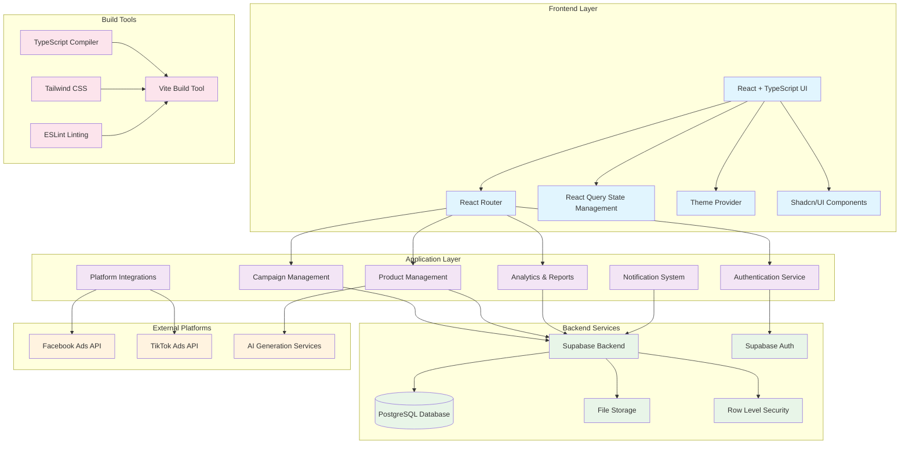

# Product Architecture

## Overview
This document outlines the architecture of the Chariot AI Command Center, showing the tech stack and data flow.

## Architecture Diagram

## Tech Stack Details

### Frontend Stack
- **React 18**: Modern React with hooks and functional components
- **TypeScript**: Type-safe development with strong typing
- **Vite**: Fast development server and build tool
- **React Router**: Client-side routing and navigation
- **React Query**: Server state management and caching
- **Tailwind CSS**: Utility-first CSS framework
- **Shadcn/UI**: Pre-built accessible UI components

### Backend & Database
- **Supabase**: Backend-as-a-Service platform
- **PostgreSQL**: Relational database with advanced features
- **Row Level Security (RLS)**: Database-level security policies
- **Supabase Auth**: Authentication and user management
- **Real-time subscriptions**: Live data updates

### External Integrations
- **Facebook Ads API**: Campaign management and analytics
- **TikTok Ads API**: Platform-specific advertising
- **AI Services**: Content generation and optimization

### Development Tools
- **ESLint**: Code linting and style enforcement
- **PostCSS**: CSS processing and optimization
- **Bun**: Package manager and runtime (lockfile present)

## Data Flow

1. **User Interaction**: Users interact with React components in the UI layer
2. **State Management**: React Query manages server state and caching
3. **API Calls**: Services layer makes calls to Supabase backend
4. **Database Operations**: Supabase handles CRUD operations with PostgreSQL
5. **External API Integration**: Platform services connect to Facebook/TikTok APIs
6. **Real-time Updates**: Supabase provides live data synchronization
7. **Authentication Flow**: Supabase Auth manages user sessions and permissions

## Security Features

- Row Level Security (RLS) policies in database
- API key management for external services
- Secure authentication with Supabase Auth
- Environment variable protection
- Type-safe API interactions

## Key Features

- **Campaign Management**: Create, monitor, and optimize ad campaigns
- **Product Management**: Add, edit, and organize product catalogs
- **Analytics & Reporting**: Real-time performance metrics and insights
- **Multi-platform Support**: Facebook and TikTok advertising integration
- **AI-powered Content**: Automated description and content generation
- **Real-time Monitoring**: Live campaign performance tracking
- **Notification System**: Alerts and performance notifications 